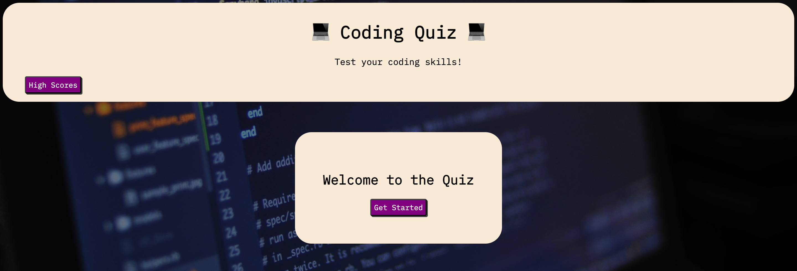

# 04-Web-APIs - Coding Quiz

## Website build

Creation of an online coding quiz, to test the skills of coders, by answering a series of questions.
Build of HMTL, CSS and JavaScript from scratch.

## User Story

* AS A coding boot camp student
* I WANT to take a timed quiz on JavaScript fundamentals that stores high scores
* SO THAT I can gauge my progress compared to my peers

## Acceptance Criteria

* GIVEN I am taking a code quiz
* WHEN I click the start button
* THEN a timer starts and I am presented with a question
* WHEN I answer a question
* THEN I am presented with another question
* WHEN I answer a question incorrectly
* THEN time is subtracted from the clock
* WHEN all questions are answered or the timer reaches 0
* THEN the game is over
* WHEN the game is over
* THEN I can save my initials and my score

The main challenge i faced, was getting to know and understand the logic and syntax of JavaScript, in order to run the functionality of the quiz. I overcame this by researching other websites using JavaScript, reading forums, looking through tutorials and practising before implementation to my own online quiz.

I also had the opportunity to practise and refine my current HTML and CSS skills.

I hope to optimize the quiz further in the future, when i have more knowledge on JavaScript, HTML and CSS.

## Using the code
I have fully commented the JavaScript files, to explain the flow and logic of the game, so that others can work on this and expand on it too.
I have also tried to use correct semantic structure within the HTML and CSS files, so the code can be easily followed and worked on.

# The Coding Quiz

## Link to deployed application.

<a href="https://enigmawoman.github.io/04-Web-APIs/">Deployed Online Coding Quiz</a>

## Screenshot of the finished website 

## License

NA